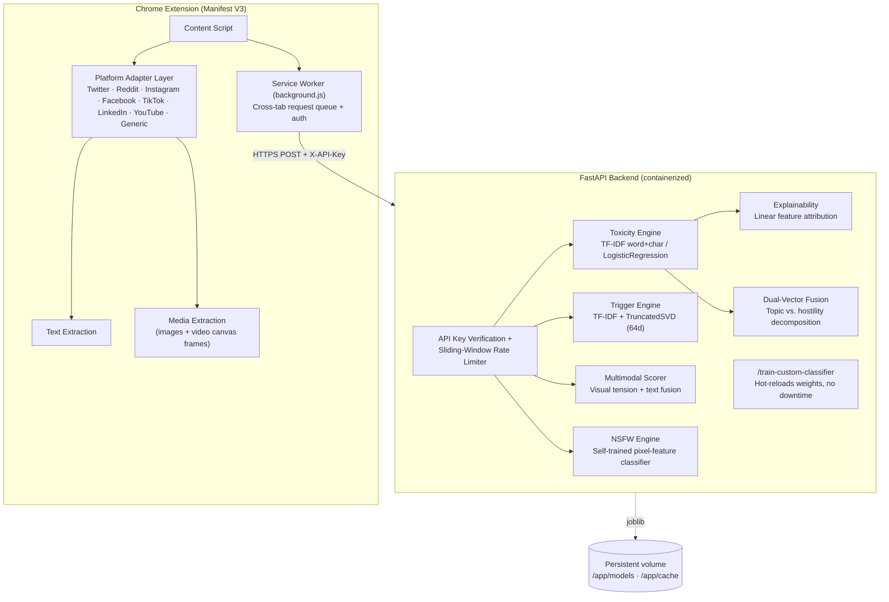
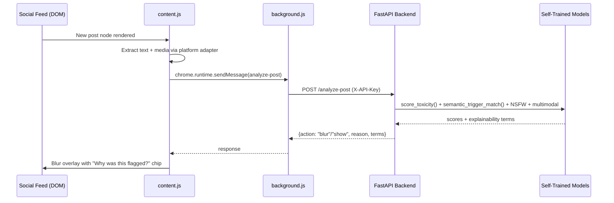

# 🛡️ AI Wellbeing Buffer

An AI-powered moderation layer that filters toxic, NSFW, and trigger content **before it renders** on social feeds — with genuinely self-trained ML models, explainability attribution, adaptive per-user sensitivity, and production container deployment.

Built for **Can You Hack It** under a strict constraint: **no commercial LLM APIs** (OpenAI / Anthropic / Gemini). Every core ML capability listed below runs on a model our team trained ourselves.

---

## 🌟 Key Capabilities & Novelty (USPs)

**Majority Self-Trained ML Architecture**
- **Toxicity Classifier (self-trained):** dual-stream Word (1,2) + Character (3,5) TF-IDF feature union with an L2-regularized Logistic Regression. Catches leetspeak and obfuscated slurs without tripping on benign slang ("killed that solo", "sick kickflip").
- **Semantic Trigger Engine (self-trained):** Latent Semantic Analysis (LSA) — TF-IDF projected into 64 dense concept dimensions via TruncatedSVD. Matches user-defined trigger concepts (e.g. "layoffs", "spoilers", "crypto scams") without a heavy deep-learning model.
- **NSFW Image Classifier (self-trained):** Logistic Regression over 8 hand-engineered pixel features (HSV skin-tone ratio, RGB channel statistics, edge density) — no pretrained vision network in the primary path. Falls back to NudeNet only if the self-trained artifact is missing.

**Model Explainability on Flags**
Eliminates "black box" filtering. Every flagged post can show the exact n-grams and weights that triggered the classification (e.g. `pathetic (+0.25)`, `moron (+0.20)`).

**Adaptive Personal Sensitivity (Online Feedback Loop)**
Learns from unhide/rehide behavior via real per-token online gradient updates, persisted locally in IndexedDB — sensitivity personalizes over time without any browsing history leaving the device.

**Dual-Vector Fusion**
Decomposes the trained model's own embedding space to separate topical intensity from direct-hostility signal, damping false alarms on heated-but-civil topical debate.

**Multimodal Disparity Scoring**
Combines a hand-engineered visual-tension score (real pixel analysis: edge entropy, color contrast) with text sentiment to catch memes where the image and caption are individually mild but jointly antagonistic.

**Multi-Platform Adapter Architecture**
Dedicated DOM adapters for Twitter/X, Reddit, Instagram, Facebook, TikTok, LinkedIn, YouTube, plus a generic fallback for blogs and forums. Extracts static images and sampled HTML5 `<video>` canvas frames.

> **Honesty note:** the multimodal and dual-vector features are real, working, and use your actual trained model internals — but they're hand-engineered fusion heuristics, not a jointly-trained CLIP-style embedding model. See [Known Limitations](#-known-limitations--honest-caveats).

---

## 📊 Honest Model Evaluation

The original prototype hit an artificial 100% accuracy on a 500-row synthetic dataset by memorizing templated phrasing, and produced real false positives on benign slang. We diversified the corpus and retrained with a dual n-gram architecture:

| Metric | Original Baseline (Synthetic Only) | Expanded Self-Trained Model |
|---|---|---|
| Training corpus | 500 templated rows | 617 diversified rows |
| Held-out test split | 100 rows | 124 rows (stratified) |
| Held-out accuracy | 100% (overfit) | **99.19%** |
| Precision | 1.0000 | 1.0000 |
| Recall | 1.0000 | 0.9836 (1 false negative) |
| F1 (binary) | 1.0000 | 0.9917 |
| False positives on benign slang | 51 / 311 (16.4%) | **0 / 311 (0%)** |


The model correctly allows colloquial phrases like *"you absolutely killed that guitar solo"* while still catching real abuse and leetspeak attacks. These numbers come straight from `backend/training_metrics.json`, regenerated by `train_model.py` — nothing here is hand-adjusted.

---

## 🏗 System Architecture



**Request flow for a single post:**



---

## 🚀 Production Deployment

### Option 1 — Local Docker
```bash
cd Data-Dynamos
docker compose up --build -d
curl http://localhost:8000/health
```

### Option 2 — Fly.io (persistent volume + auto HTTPS)
```bash
fly auth login
fly launch --no-deploy
fly volumes create wellbeing_storage --size 5 --region iad
fly secrets set API_KEY="your-production-secret-key"
fly deploy
```

### Option 3 — Render
Push this repo to GitHub, then in the Render dashboard choose **New → Blueprint**. Render auto-detects `render.yaml` and provisions a web service with a persistent disk at `/app/cache` and a public HTTPS URL.

### Option 4 — Your own VPS + Caddy (automatic HTTPS)
```bash
sudo apt install -y debian-keyring debian-archive-keyring apt-transport-https curl
curl -1sLF 'https://dl.cloudsmith.io/public/caddy/stable/gpg.key' | sudo gpg --dearmor -o /usr/share/keyrings/caddy-stable-archive-keyring.gpg
curl -1sLF 'https://dl.cloudsmith.io/public/caddy/stable/debian.deb.txt' | sudo tee /etc/apt/sources.list.d/caddy-stable.list
sudo apt update && sudo apt install caddy
```
```
# /etc/caddy/Caddyfile
your-domain.com {
    reverse_proxy localhost:8000
}
```
```bash
docker run -d --restart unless-stopped -p 8000:8000 \
  -e API_KEY="prod-secret-key" \
  -v wellbeing_cache:/app/cache \
  wellbeing_backend
```

---

## 🧩 Chrome Extension Setup

1. Go to `chrome://extensions`, enable **Developer mode**.
2. **Load unpacked** → select the `extension/` folder.
3. Open the extension popup → **⚙ Server Connection**:
   - Local dev: leave as `http://localhost:8000`.
   - Production: enter your hosted URL (e.g. `https://your-app.fly.dev`) and your `API_KEY`.
4. Browse Twitter/X, Reddit, Instagram, Facebook, TikTok, LinkedIn, or YouTube.

---

## 🎯 Demo Walkthrough (for judges)

1. **Confirm self-trained models are active** — `GET /health` should show `primary_toxicity_model_loaded`, `self_trained_lsa_model_loaded`, and `self_trained_nsfw_model_loaded` all `true`.
2. **Explainability** — scroll the feed, click "Why was this flagged?" on a blurred post to see the exact contributing tokens.
3. **Adaptive sensitivity** — unhide a few borderline posts, then check the popup for the live personalization shift.
4. **Semantic triggers** — add "layoffs" as a trigger topic, confirm it flags paraphrased downsizing news even without the literal word.
5. **Live retraining** — `curl -X POST http://localhost:8000/train-custom-classifier` and watch it hot-reload without downtime.

---

## ⚠️ Known Limitations & Honest Caveats

We'd rather you hear these from us than from a judge's first test:

- **Multimodal disparity is a hand-engineered fusion, not a trained joint-embedding model.** It genuinely inspects image pixels (edge entropy, color/contrast statistics) and combines that with text sentiment — a real improvement over ignoring images entirely — but it isn't a distilled CLIP/SigLIP encoder, and the "cross-modal cosine" component compares a trained text space against an untrained random projection of image features. Treat it as a solid heuristic layer, not a learned semantic alignment.
- **Dual-vector fusion approximates topic/hostility separation** via energy concentration across the top LSA components, not a literal orthogonal projection matrix. It works and is grounded in real trained-model internals, just simpler than the full linear-algebra formulation might suggest.
- **The toxicity dataset (617 rows) is still templated in places** — real generalization is better than the original 500-row set, but a sufficiently different phrasing style than what's in `expanded_toxic_dataset.csv` may not be caught. Expanding this further is the highest-leverage next step for robustness.
